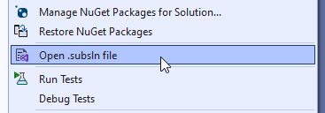
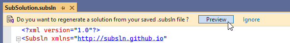
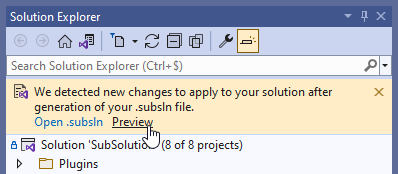

# SubSolution

[](https://marketplace.visualstudio.com/items?itemName=ReMinoer.SubSolution2022)
[](https://www.nuget.org/packages/subsln)
[](https://www.nuget.org/packages/SubSolution)

[](https://github.com/ReMinoer/SubSolution/actions/workflows/change.yml)
[](https://github.com/ReMinoer/SubSolution/actions/workflows/release.yml)

SubSolution is a tool set giving you control on your Visual Studio solutions.

It includes various tools:

- __.Subsln files__ able to generate .sln files.
- __A Visual Studio extension__ using .subsln files to update your solutions.
- __A command line tool__ working with .subsln files.
- __.NET libraries__ to read/write/edit solutions in many ways.

# Configuration files: `.subsln`

SubSolution use XML files with the extension `.subsln` to describe the content of Visual Studio solutions in a user-friendly syntax.

You can find the .subsln format documentation at this address: **https://subsln.github.io**.

That address is also the XML namespace used by .subsln files so you will always be a click away from the doc!

```xml
<Subsln xmlns="http://subsln.github.io">
    <Root>
        <Folder Name="Tools">
            <Files Path="tools/*.bat" />
        </Folder>
        <Folder Name="Tests">
            <Projects Path="**/*.Tests.csproj" />
        </Folder>
        <Projects Path="src/">
    </Root>
</Subsln>
```

## Syntax overview

- Describe your item hierarchy: `<Root>`
    - Add projects with glob patterns: `<Projects>`
    - Add files for quick-access: `<Files>`
    - Create folders to organize your items: `<Folder>`
    - Find project dependencies and dependents: `<Dependencies>` / `<Dependents>`
    - Include the content of existing solutions: `<Solutions>` / `<SubSolutions>`
    - Select what you want to keep from other solutions: `<KeepOnly>`
    - Apply complex filters on your item sources: `<Where>`
- Setup your solution configuration-platforms: `<Configurations>` / `<Platforms>`
    - Ignore them to auto-generate from projects.
    - Create new ones: `<SolutionConfiguration>` / `<SolutionPlatform>`
    - Match them with project configurations and platforms: `<ProjectConfiguration>` / `<ProjectPlatform>`
- And a lot more options as XML attributes !

The complete documentation is available on **https://subsln.github.io**.

## Why use a `.subsln` file ?

- It allows you to __express your solution organization rules__ ("those projects in that folder, unit tests in that one...") and ensure they are respected on solution changes.
- It acts as a __substitute or edition assistant__ of .sln files, to describe the solution content with a user-friendly structure similar to the Visual Studio "Solution Explorer" representation.
- It can also be used as a punctual tool, to __apply a one-time update__.
- It allows to __quickly iterate__ on your solution structure until it matches your needs, without requiring to run Visual Studio.
- It can __build an entirely customized hierarchy__, or at contrary mirror your file system structure.
- It can __find and fill your solution with dependencies__ of your central projects.
- It can describe solutions __in a modular way__ by including the content of a solution into another.
- It makes it easier to __apply changes to multiple solutions__ sharing the same projects.
- It can __create a smaller solution from a big one__ to have a better environment or performances in Visual Studio.

# Visual Studio extension

[](https://marketplace.visualstudio.com/items?itemName=ReMinoer.SubSolution2019)
[](https://marketplace.visualstudio.com/items?itemName=ReMinoer.SubSolution2022)

The Visual Studio extension includes the following features:

- You can create/open the .subsln file associated to the current solution from the Solution Explorer context menu.

  

- When saving a .subsln file, you can see a preview of the updated solution and decide if you want to apply it or not.

  

- When opening a solution, it automatically checks if your solution is up-to-date.

  

# Command line tool: `subsln`

[](https://www.nuget.org/packages/subsln)

"`subsln`" is a command line tool using `.subsln` configuration files to build Visual Studio solutions.

```bash
> subsln create MySolution
> subsln generate MySolution.subsln
> subsln validate MySolution.subsln
> subsln show MySolution.sln
```

Install it with the [.NET SDK](https://dotnet.microsoft.com/download) command line:

```bash
> dotnet tool install subsln --global 
```

Check the [Releases](https://github.com/ReMinoer/SubSolution/releases) page for standalone executables.

By default, `subsln` will try to find MSBuild binaries on your machine. There are multiple options to specify which MSBuild binaries use to read projects. Use `subsln help` or `subsln [command] --help` for more details on commands.

# .NET libraries

[](https://www.nuget.org/packages/SubSolution)
[](https://www.nuget.org/packages/SubSolution.Builders)
[](https://www.nuget.org/packages/SubSolution.MsBuild)

You can use SubSolution .NET libraries as Nuget packages:

- [SubSolution](https://www.nuget.org/packages/SubSolution): core package to edit solutions using minimum dependencies.
- [SubSolution.Builders](https://www.nuget.org/packages/SubSolution.Builders): solution building features used by .subsln format.
- [SubSolution.MsBuild](https://www.nuget.org/packages/SubSolution.MsBuild): project reader implementation based on MSBuild.

The API is structured around 3 representations of solutions:

- __`Solution`__:
    - Match the Visual Studio edition experience.
    - Edit the item hierarchy as it show in the Solution Explorer.
    - Automatically fill solution configurations-platforms with your projects.
    - Use __`ManualSolution`__ to manually fill configuration-platforms.
- __`RawSolution`__:
    - Match the .sln format.
    - Dedicated to input/ouput files (but hard to edit).
    - Convert to/from __`Solution`__ with __`RawSolutionConverter`__/__`SolutionConverter`__.
- __`Subsln`__:
    - Match the .subsln format.
    - Dedicated to build patterns & modular usages.
    - Build __`Solution`__ with __`SolutionBuilder`__.

> __SubSolution is currently released as version v0.__ All core features are already implemented but it needs to be tested in more practical cases.
>
> Also be aware of the following:
>
> - Some small API breaking changes might happen until version v1.
> - Some MSBuild project types are not supported yet. ([Supported project types](https://github.com/ReMinoer/SubSolution/blob/master/Sources/SubSolution/ProjectType.cs))

## About MSBuild usage

`SubSolution.MsBuild` implements `MsBuildProjectReader` to read projects with MSBuild. But core MSBuild DLLs are not enough to read every project types because some dependencies are installed by Visual Studio modular setup. The MSBuild setup coming with .NET SDK also mostly support .NET projects only.

For that reason, `SubSolution.MsBuild` package does not come with MSBuild DLLs to let you choose between multiple strategies if you need a project reader:

1. Use [Microsoft.Build.Locator](https://docs.microsoft.com/en-gb/visualstudio/msbuild/updating-an-existing-application) to use existing MSBuild binaries on the user machine. For example, it can use MSBuild from a local Visual Studio or a .NET SDK install.
    - It is recommended to target a framework compatible with the MSBuild binaries you are trying to use in that case.
2. Use [Microsoft.Build](https://www.nuget.org/packages/Microsoft.Build) NuGet package to get only the core DLLs + set `MsBuildProjectReader.ImportFallback` to true to read project even on missing import/SDKs.
3. Implement your own `IProjectReader` if you don't want to depends on MSBuild.

# Contribute

- Install [.NET SDK](https://dotnet.microsoft.com/download)
- Make a fork of the repo.
- Clone it locally (including submodules if you are using ReSharper in Visual Studio).
- Build the solution.
    - It will automatically install [LinqToXsdCore](https://github.com/mamift/LinqToXsdCore) to generate C# from the XML schema.
- Make your changes.
- Submit a pull request.
